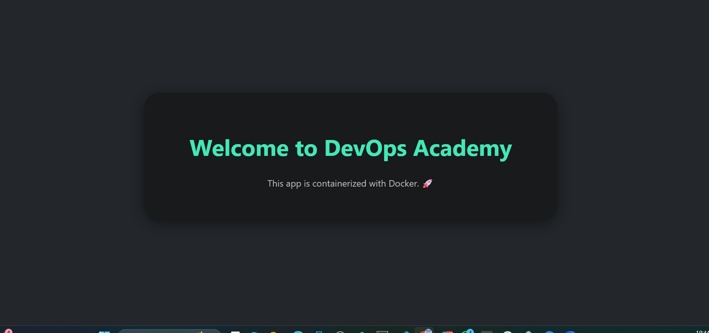

# 🚀 DevOps Academy Flask App

## Dockerized Flask app for learning DevOps and Docker concepts

This project helps learners understand how to:
- Build a lightweight Python web app using Flask
- Containerize it with Docker
- Expose and map ports between host and container
- Pass environment variables into the container
- Deploy and test on local or cloud platforms (like EC2)

<br>

<p align="center">
  
</p>

---

## 📁 Project Structure

```

Docker-devops-academy-flask/
├── app.py
├── Dockerfile
├── requirements.txt
├── templates/
│   └── index.html
└── .dockerignore

````

---

## 📦 Prerequisites

- [Docker](https://docs.docker.com/get-docker/) installed
- Optional: An AWS EC2 instance with Docker installed
- Git (to clone the repo)

---

## 🛠️ How to Clone and Run

### 🔹 Step 1: Clone the Repo

```bash
git clone https://github.com/m-pasima/Docker-devops-academy-flask.git
cd Docker-devops-academy-flask
````

---

### 🔹 Step 2: Build the Image

```bash
docker build -t devops-academy-flask .
```

---

### 🔹 Step 3: Run the Container

```bash
docker run -d \
  -p 8080:5000 \
  -e ACADEMY_NAME="DevOps Academy" \
  --name flask-app \
  devops-academy-flask
```

Now visit: [http://localhost:8080](http://localhost:8080) or `http://<EC2-IP>:8080`

---

### 🧪 Health Check (Optional)

This container exposes Flask on port 5000 internally. The `HEALTHCHECK` in Dockerfile ensures it's alive:

```Dockerfile
HEALTHCHECK CMD curl --fail http://localhost:5000/ || exit 1
```

To inspect it:

```bash
docker inspect --format='{{json .State.Health}}' flask-app
```

---

## ✨ Features

✅ Flask dynamic template
✅ Beautiful UI using HTML & Google Fonts
✅ Container exposes a customizable academy name
✅ Environment-variable-driven deployment
✅ Production-ready Dockerfile structure

---

## 📸 UI Preview

<p align="center">
   
</p>

---

## 🧼 .dockerignore

```dockerignore
__pycache__/
*.pyc
.env
*.log
*.zip
.DS_Store
.git
```

---

## ✅ Author

👩🏽‍💻 **Pasima** – DevOps Engineer & Cloud Educator
🔗 [GitHub Profile](https://github.com/m-pasima) | [DevOps Academy Projects](https://github.com/m-pasima?tab=repositories)

---

## 📄 License

This project is licensed under the **MIT License**.

---

> **“Build with Docker. Think in CI/CD. Deploy like a cloud-native.”**

🚀 Happy Deploying from DevOps Academy!


